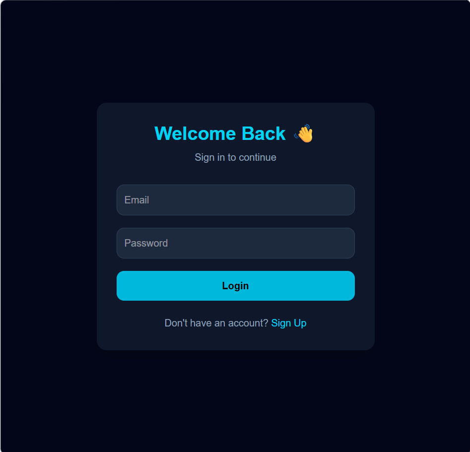
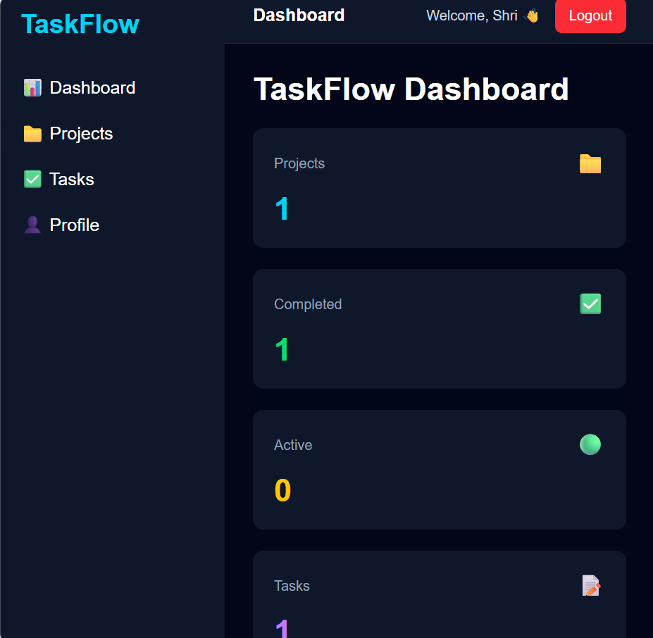
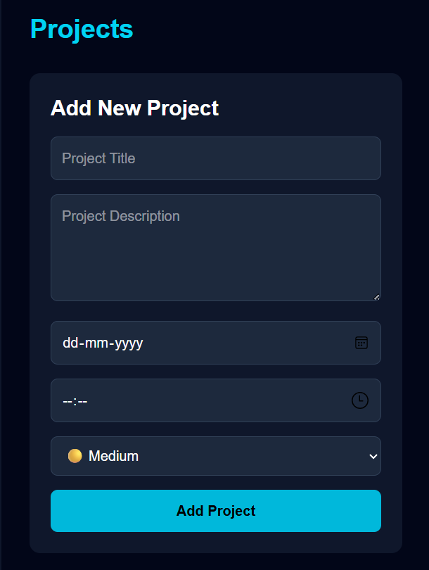
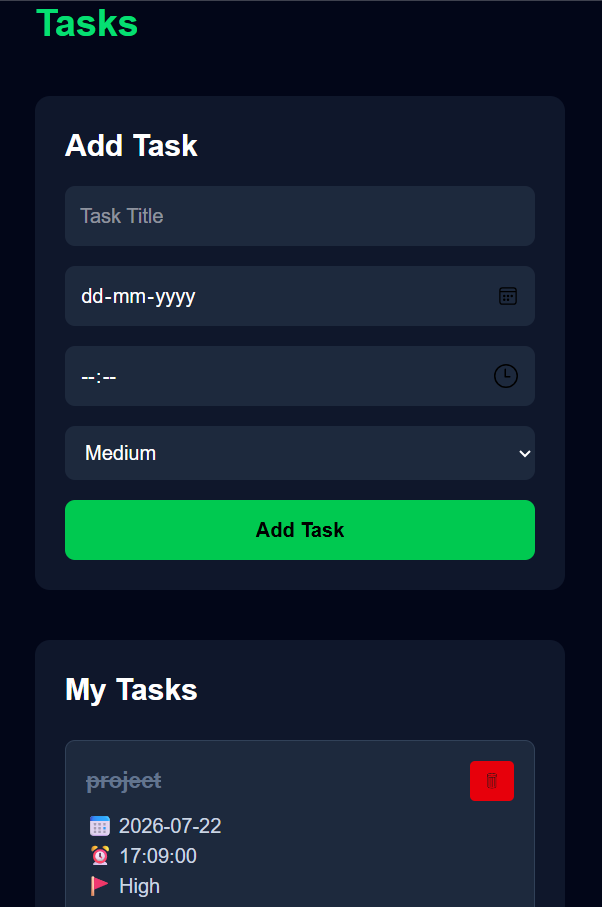
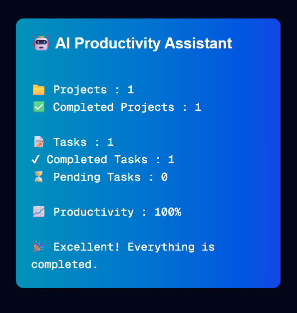

# TaskFlow – AI-Powered Project Management System

This project was developed as part of the CodSoft Web Development Internship (Level 3 – Task 2).

## Project Overview

TaskFlow is a full-stack project management application that allows users to create projects, manage tasks, set priorities, assign deadlines, and monitor progress. The application also includes an AI Productivity Assistant that provides suggestions based on pending tasks and deadlines.

## Features

- User authentication
- Dashboard with project statistics
- Create, edit and delete projects
- Create, edit and delete tasks
- Set due dates and priorities
- Mark projects and tasks as completed
- AI Productivity Assistant
- Responsive user interface

## Technologies Used

- Next.js
- React
- TypeScript
- Tailwind CSS
- Supabase
- PostgreSQL
- Vercel

## Live Demo

https://taskflow-project-management-9csp.vercel.app

## GitHub Repository

https://github.com/JayashriThillai/CODSOFT_TASKNO

## Screenshots

### Login Page

### Dashboard

### Projects

### Tasks

### AI Productivity Assistant

## Future Improvements

- Email reminders
- Browser notifications
- Calendar view
- Team collaboration
- Mobile application

## Developer

Jayashri T